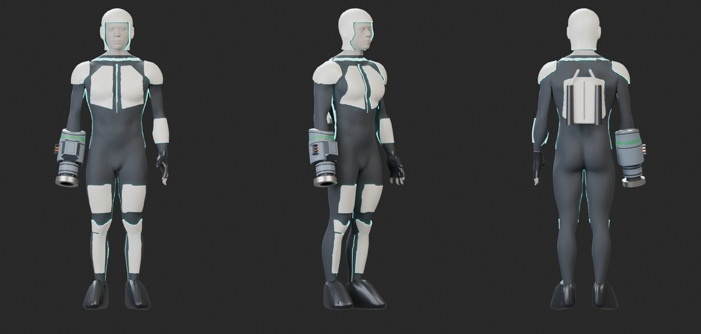
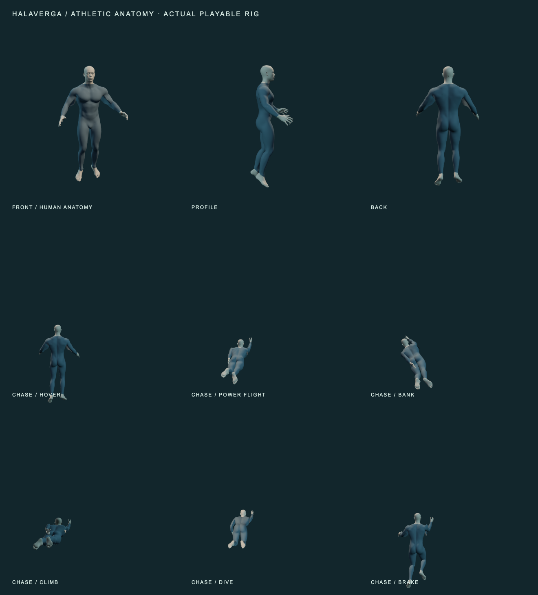

# Athletic anatomy in the playable character

## Meridian Envoy outfit (2026-10-06)

Garo found the bare mannequin "basic cookie cutter" and picked concept C, **Meridian Envoy**, from three AI concept sketches:
bone-white ceramic plates over a dark graphite undersuit, glowing teal seams, an open-face helmet, a slim back flight module with
two short fins, sealed boots with a teal sole line and a glove on the left hand. The right forearm and hand stay bare for the arm
cannon.



- Built by `scripts/athletic_character/outfit.py` and `outfit_shapes.py` inside `build.py`, from code only: every plate is cut
  from the approved undersuit or anatomy surface in the source pose, lifted off it and given a rim (the rim carries the glow), so
  it fits by construction; the boots are the convex hull of each foot and ankle; the helmet is the head shell, smoothed, with the
  face left open (a blank helmet hid which way the hero faced). `rig.bind` weights the outfit exactly like the body.
- One extra skinned surface, `Explorer armour`, with two materials: `plate` (vertex colours: bone white, graphite for boots,
  glove and module pods) and `glow` (teal, emissive strength 3.5). No textures, no texcoords. The undersuit turned dark graphite.
- Budget revised again: **54,400 triangles** (+13,200), five batches (+2), **2.08 MB** GLB (+0.63 MB; test cap 2.2 MB).
- The undersuit, anatomy, eyes, rig and the arm cannon contract are unchanged (all cannon and blaster-skin tests pass as before).
- `build.py` no longer re-saves the 23 MB `character.blend` on every build (the outfit is code); `SAVE_BLEND=1` still does.

The anatomy approved in the preceding review now replaces `public/models/suit.glb`.
The developed shoulders, tapered waist, torso depth, and anatomical limbs are present
in the actual third-person flight character. This stage retains the approved graphite
undersuit and neutral head, hands, and feet. Face identity, hair, boots, gloves, armor,
and final texture work remain later art stages; this is not a finished AAA character.



## Asset and rig

- **41,200 triangles**, three material batches, 21 bones, at most four influences per vertex.
- **1.46 MB GLB**, embedded geometry and scalar PBR materials; no external textures or animation tracks.
- The 1.85 m approved anatomy uses a uniform 1.98/1.85 game scale (about two metres
  after posing). Arms are lowered fourteen degrees and leg splay closed six degrees
  into the relaxed animation rest stance. The trunk
  and legs retain their approved proportions. Invisible inner cloth geometry is omitted.
- Bone names, parent relationships, index order, and neutral animation axes stay compatible
  with the flight clips. The loader reads authored joint positions instead of forcing
  the new body onto the previous mannequin's pivots. The legacy rigid fallback remains.
- The browser budget is explicitly revised from 20,000 to 42,000 triangles and from
  850 KB to 1.6 MB. Batch count falls from eight to three. This buys anatomical contour
  fidelity; performance measurements are recorded separately, not inferred from counts.

## Editable source and rebuilding

`art/athletic-character/character.blend` contains the runtime rig and reduced surfaces,
plus the hidden approved master, its original topology and shape keys, and the original
derived cloth and exposed surfaces. It is independent of the previous review worktree.
The original approval source SHA-256 is recorded in `asset.json`; it identifies the
preceding proof, not a hash of the current editable file.

```sh
/Applications/Blender.app/Contents/MacOS/Blender --background --python scripts/athletic_character/build.py
SUIT_REVIEW_OUTPUT=docs/art/athletic-character/poses.png node scripts/review-athletic-poses.mjs
SUIT_FLIGHT_OUTPUT=docs/art/athletic-character/motion.png node scripts/review-flight-motion.mjs
pnpm verify
```

The exporter uses the retained, unreduced approved surfaces on rebuild. The master’s
anatomy and garment shape keys are editable; after master edits regenerate the cloth
and exposed surfaces before export, or edit those original surfaces directly. Runtime
surface edits are replaced by the exporter. The proof-specific `review-flight-poses`
script expects the previous character's two face/hair atlases; use the anatomy review
command above for this asset. Motion strips use the shared runtime review script.

Base anatomy: **Body Male – Realistic**, Dan Ulrich, Blender Studio, **CC0**, from
[Blender's Human Base Meshes](https://www.blender.org/download/demo-files/).
The adult Peter Parker reference supplied physique direction only; no Marvel game
mesh, texture, face likeness, or costume was imported.

## Validation

See `verification.md` for test results, gameplay captures, measurements, and limits.
`asset.json` records the actual exported asset hash and mesh counts.
