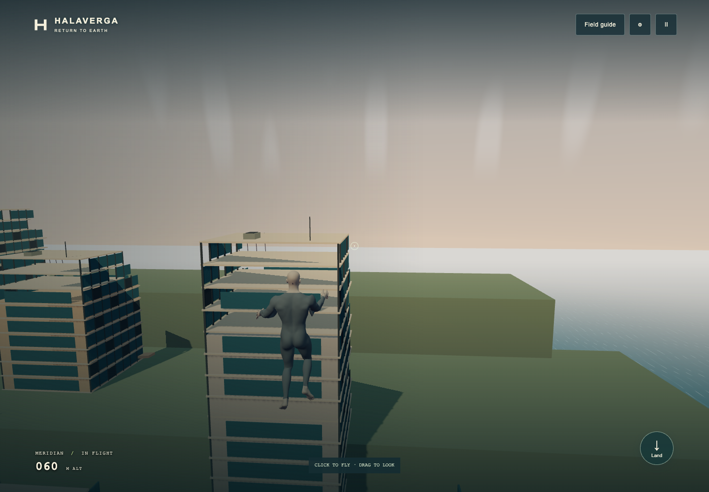

# Athletic character verification · 2026-09-19

The implementation is based on `main` at `1b23fe3`, which includes the completed
turn-roll work. The character integration changes the asset, its bind-position
loader, art sources, and verification; it does not rewrite movement or cameras.

## Functional and visual checks

- `pnpm verify`: type checks, **220 unit tests across 28 files**, production build,
  and landing-page budget pass. First load: **601.6 KB across eight scripts**.
- Production-preview Playwright run: **11 passed**, covering flight, composition,
  the authored clips and turn roll, pause/camera switching, portrait/landscape resize,
  landing cancellation, context loss, asset-load failure and reload, and automated
  WCAG A/AA checks. No physical phone was used.
- New regression coverage checks that the lower legs cannot receive arm weights
  and that rebinding preserves every rest-pose vertex within one micrometre.
  Existing normalized weights, joint hierarchy/axes, connected cloth surface,
  source ownership/disposal, movement and facing tests remain active.
- `poses.png` and `motion.png` render the real exported GLB with the game's own
  rig and animation functions. Reviewed front/profile/rear, hover, cruise, fist
  deployment, surge, banking and turn roll, climbing/diving, braking, takeoff and
  touchdown. The source stance is fitted at shoulders, hips, knees, ankles and toes.
- The in-app browser was opened on the actual production preview and checked on
  the terrace and in flight. Its served GLB hash matched `asset.json` and disk.
- Rebuilding from the retained source surfaces in the new Blender file was checked
  independently of the earlier proof worktree. Before the subsequent stance edits,
  positions, UVs, joint indices and weights matched the proof-based export exactly;
  recalculated normal components differed by at most 0.000098.

```sh
PLAYTEST_URL=http://127.0.0.1:3474 pnpm exec playwright test \
  tests/flight.spec.ts tests/composition.spec.ts tests/accessibility.spec.ts \
  tests/recovery.spec.ts tests/suit-clips.spec.ts
```

## Performance

The five-minute desktop route and its measurements are saved under `profile/`.
This is a production-build run in system Chrome at 1440 × 1000 with surge enabled,
on the physical Mac. The in-app review was also open. It is not an iPhone result.

**Apple M2 Max, high quality, 300 active seconds / 17,998 samples:** median frame
interval **16.7 ms**, p95 **17.3 ms**, **zero frames above 50 ms**, and no browser
errors. Peak scene resources: nine draw calls, 119,486 triangles, eight geometries,
five textures. These are whole-scene counts, not just the character.

The raw UI measurement export contains the app's configured `deployment` URL;
the test actually ran on `http://127.0.0.1:3474`, not that public deployment.
`profile/context.json` identifies the exact asset and runtime source snapshot.



## Remaining art and device work

The approved physique is implemented. The neutral face and eyes, bald scalp,
exposed hands/feet, and plain undersuit are deliberately still the anatomy-stage
surfaces. They need the later identity, hair, costume and texture passes. No AAA
finish or exact Peter Parker likeness is claimed. Joint-bound hands currently use
the existing wrist controls; the 21-bone rig has no independently animated fingers.

Physical iPhone Safari performance, touch feel, VoiceOver and player enjoyment
still need a real-device playtest. Automated resize and AA checks do not establish
those results.
